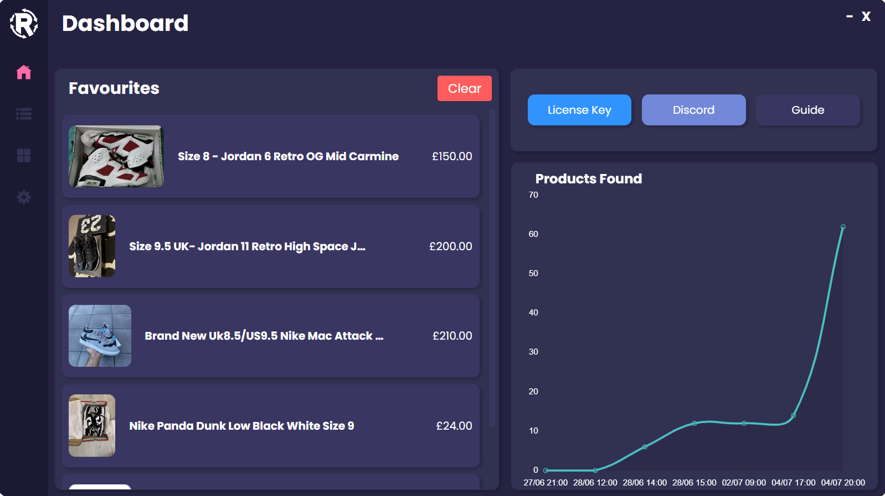
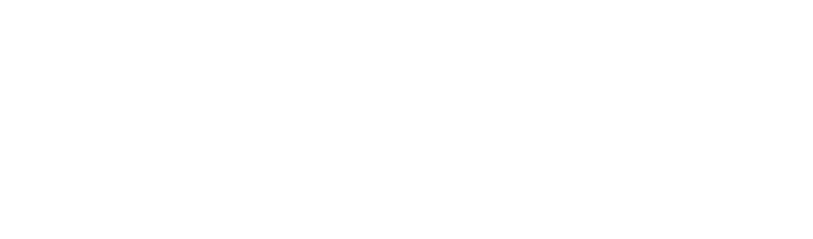

  

    

Resoled is a desktop application designed to enhance your eBay shopping experience. With Resoled, users can create tasks to monitor eBay for new listings and listings that are ending soon. It provides real-time notifications to ensure you never miss out on a great deal.

## Features

- **Task Creation:** Easily set up tasks to track eBay listings based on specific criteria such as keywords, categories, or price ranges.
- **Real-Time Notifications:** Get alerted immediately when new listings match your criteria or when watched listings are about to end.
- **User-Friendly Interface:** Simple and intuitive interface, making it easy to navigate and manage your tasks.
- **Customizable Alerts:** Choose how and when you want to be notified about relevant eBay listings.

## Getting Started

To get started with Resoled, follow these simple steps:

1. **Download the Application:** Download the latest version of Resoled from the releases [here](https://github.com/ctrl-cheeb-del/Resoled/releases).
2. **Install the Application:** Follow the installation guide and enter your license key to get Resoled on your machine
3. **Create Your First Task:** Launch Resoled and create your first task to start monitoring eBay listings.
4. **Adjust Settings:** Customize your notification preferences and monitor settings to suit your needs.

## Prerequisites

Before installing Resoled, ensure you have the following:

- Compatible operating system (Windows/MacOS)
- Internet connection
- Valid license key (Can Buy [Here](https://www.resoled.it/))

## Installation

Download the installer from the provided link, and run it. Follow the on-screen instructions to complete the installation.

## Usage

Here is how you can use Resoled to stay ahead in your reselling business:

1. Open the application.
2. Set up a new task by specifying your search criteria.
3. Check the listings page to stay informed about new results.
4. Monitor your tasks from the dashboard.
